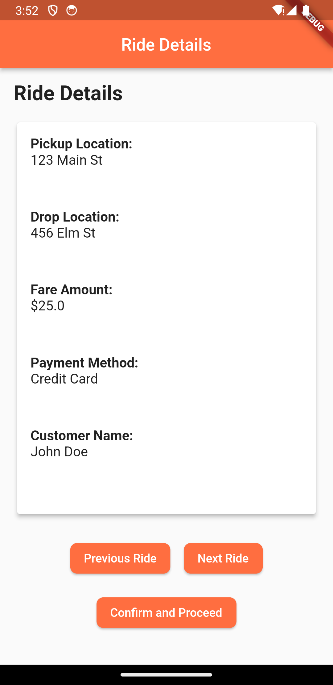

# tts_pro

A new Flutter project.

## Getting Started

This project is a starting point for a Flutter application.

A few resources to get you started if this is your first Flutter project:

- [Lab: Write your first Flutter app](https://docs.flutter.dev/get-started/codelab)
- [Cookbook: Useful Flutter samples](https://docs.flutter.dev/cookbook)

For help getting started with Flutter development, view the
[online documentation](https://docs.flutter.dev/), which offers tutorials,
samples, guidance on mobile development, and a full API reference.

### Features 

Here are some features of the project:

Ride Details Display: The project displays important ride details, including pickup location, drop location, fare amount, payment method, and customer name.

Text-to-Speech (TTS): It utilizes the Flutter TTS plugin to read out the ride details to the driver, enhancing accessibility and convenience.

Navigation: The screen allows the driver to navigate between multiple ride details, including previous and next rides.

Confirmation Button: A "Confirm and Proceed" button is included, which enables the driver to confirm that they've received and understood the ride details.

Error Handling: The project handles potential errors in the TTS process and provides appropriate error messages to the user.

User Interface: It has an organized and visually appealing user interface with rounded buttons and card-based layout.

Accessibility: The app is designed to be accessible to users with disabilities, including support for screen readers.

Testing: The project includes thorough testing scenarios to ensure the accuracy of TTS, handle various ride scenarios, and provide a seamless user experience.

State Management: It efficiently manages the state of the current ride, including confirmation status and navigation.

Next Screen Transition: Upon confirmation, the driver can seamlessly proceed to the next screen in the app.

Data Management: The ride details are managed in a structured way using a class, enhancing code organization and reusability.

Localization: The app can be extended to support multiple languages, ensuring a broader user base.

Performance: The project considers performance aspects, especially when dealing with larger datasets or long text-to-speech operations.

Edge Case Handling: It addresses potential edge cases, such as empty ride details or special characters in data.

User Experience: The project focuses on delivering a user-friendly experience with intuitive navigation and clear information presentation.

Cross-Platform: If applicable, the app can be deployed on both Android and iOS platforms.

State Persistence: The app ensures that the state is persisted correctly, even when the app is paused or resumed.

## Usage 

Installation:

Make sure you have Flutter and Dart installed on your development machine. If not, follow the official installation guide: Flutter Installation.
Project Setup:

Create a new Flutter project or use an existing one.
Dependencies:

Ensure you have the required dependencies added to your pubspec.yaml file. In this case, you need the flutter_tts plugin for text-to-speech:
yaml
Copy code
dependencies:
  flutter:
    sdk: flutter
  flutter_tts: ^x.x.x  # Replace 'x.x.x' with the latest version
Run flutter pub get to fetch the dependencies.

Copy Code:

Replace the existing code in your project's main Dart file (usually main.dart) with the code provided for the RideDetailsScreen and related classes.
Data Setup:

Create a list of RideDetails objects to represent your ride details. You can use the RideDetailsProvider class to encapsulate this data, as shown in previous responses.
Testing:

Make sure to thoroughly test your RideDetailsScreen to ensure that text-to-speech works, navigation functions correctly, and the confirmation button functions as expected. Follow the testing scenarios mentioned earlier in this conversation.
Localization (Optional):

If you want to support multiple languages, consider adding localization support to your project.
Customization:

Customize the appearance and behavior of your RideDetailsScreen to match your application's design and user experience.
Deployment:

Deploy your Flutter app to the desired platform (Android, iOS, etc.) by following the official deployment guides provided by Flutter.
User Instructions:

Provide clear instructions to the end-users on how to access the ride details screen and use its features, including navigation and confirmation.
Documentation:

Keep your code well-documented for future reference and maintainability.
Testing on Devices:

Test your app on real devices to ensure a consistent user experience.
Bug Fixes and Updates:

Address any issues or bugs that arise during testing, and consider adding new features or improvements based on user feedback.

